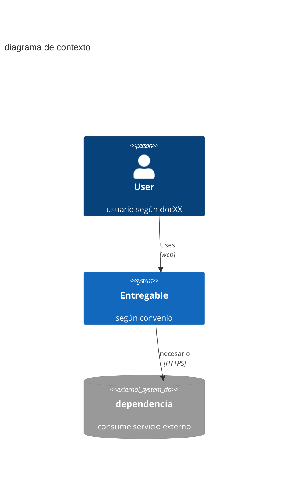

```mermaid
C4Context

title diagrama de contexto

Person(user, "User", "usuario según docXX")

System(entregable, "Entregable", "según convenio")

SystemDb_Ext(dependencia, "dependencia", "consume servicio externo")

Rel_D(user, entregable, "Uses", "web")
Rel_D(entregable, dependencia, "necesario", "HTTPS")

UpdateLayoutConfig($c4ShapeInRow="1")
```
[ayuda](https://mermaid.js.org/syntax/c4.html)
