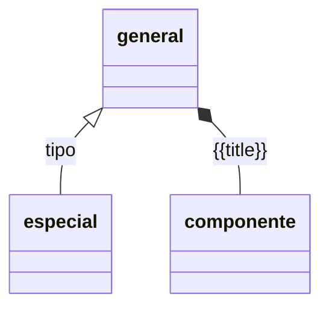

[ayuda](https://mermaid.js.org/syntax/classDiagram.html)

| Type  | Description   | Comentario |
| ----- | ------------- | ---------- |
| <\|-- | Inheritance   |            |
| `*--` | Composition   |            |
| `o--` | Aggregation   |            |
| `-->` | Association   |            |
| `--`  | Link (Solid)  |            |
| `..>` | Dependency    |            |
| ..\|> | Realization   |            |
| `..`  | Link (Dashed) |            |
