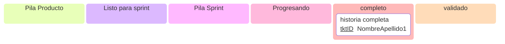

[ayuda](https://mermaid.js.org/syntax/kanban.html)

```
  pilap[Pila Producto]
  refinado[Listo para sprint]
  pilas[Pila Sprint]
  asignado[Progresando]
  espera[Esperando]
  completo
```


```
Backlog
Ready
Coding
Testing
Approval
Blocked
Deploy
```
